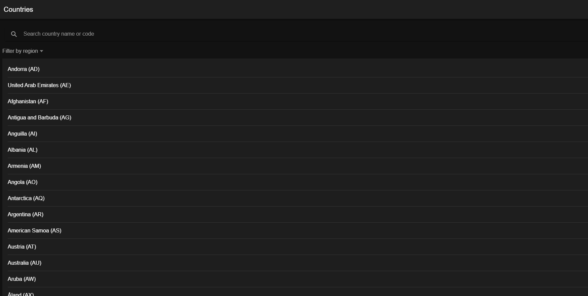
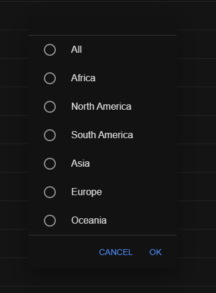
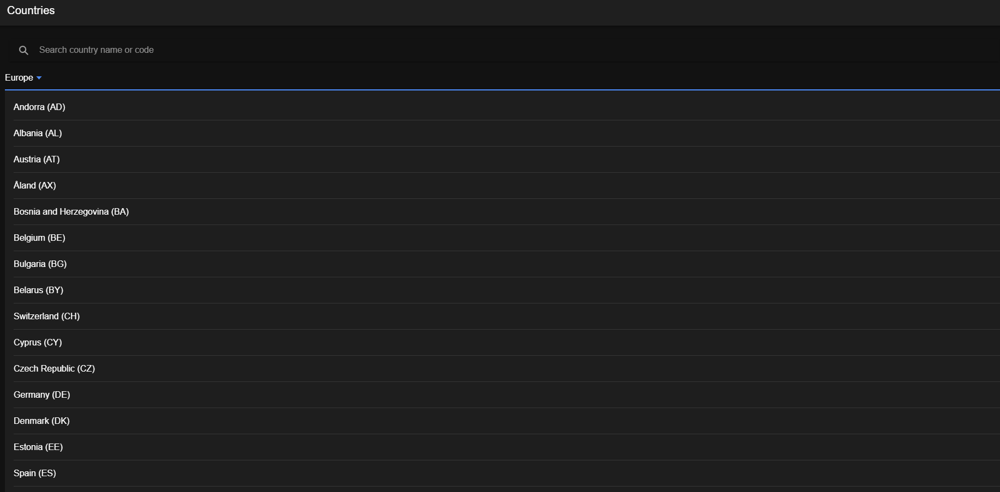
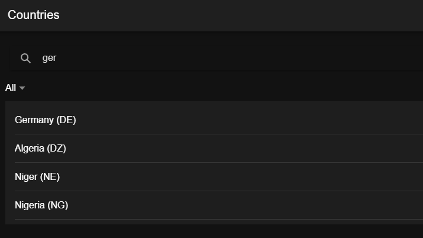
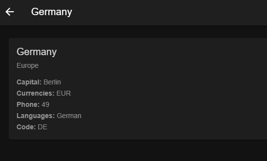

# Country Dashboard

The project is a frontend application built with Ionic Angular. Goal of the project is to display country information
by using a public API. The focus of the project is a clean architecture, user interaction and UX states.

---

## Features

- List of countries
- Search countries by name or code
- Filter countries by region
- Country detail page with routing
- Loading, error and empty states

---

## Architecture Overview

The application follows a simple layered frontend architecture:

- **Feature-based UI pages** (Country List & Detail)
- **Central CountryService** for data access
- **Typed models** for country data
- **External API** as data source

UI logic (search & filter) is handled in the pages while data fetching is centralized in services.

---

## Tech Stack

- Angular (latest, standalone components)
- Ionic Framework
- TypeScript
- RxJS
- GraphQL API (countries.trevorblades.com)

---

## Screenshots

### Homepage


### Filter



### Search


### Details


## Getting Started

### Prerequisites
- Node.js (>= 18)
- Ionic CLI

### Installation

```bash
npm install
```

### Run the application

```bash
ionic serve
```

## Author

Created by **Furkan Sütcü**.